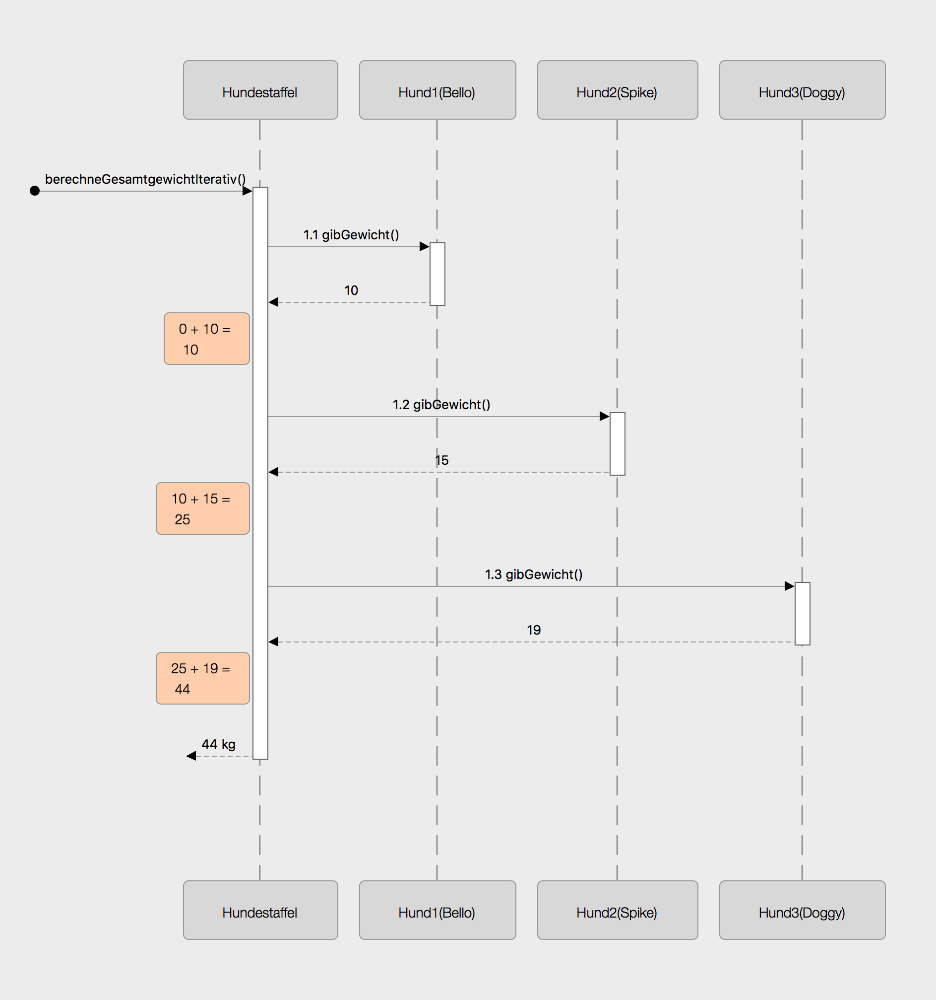
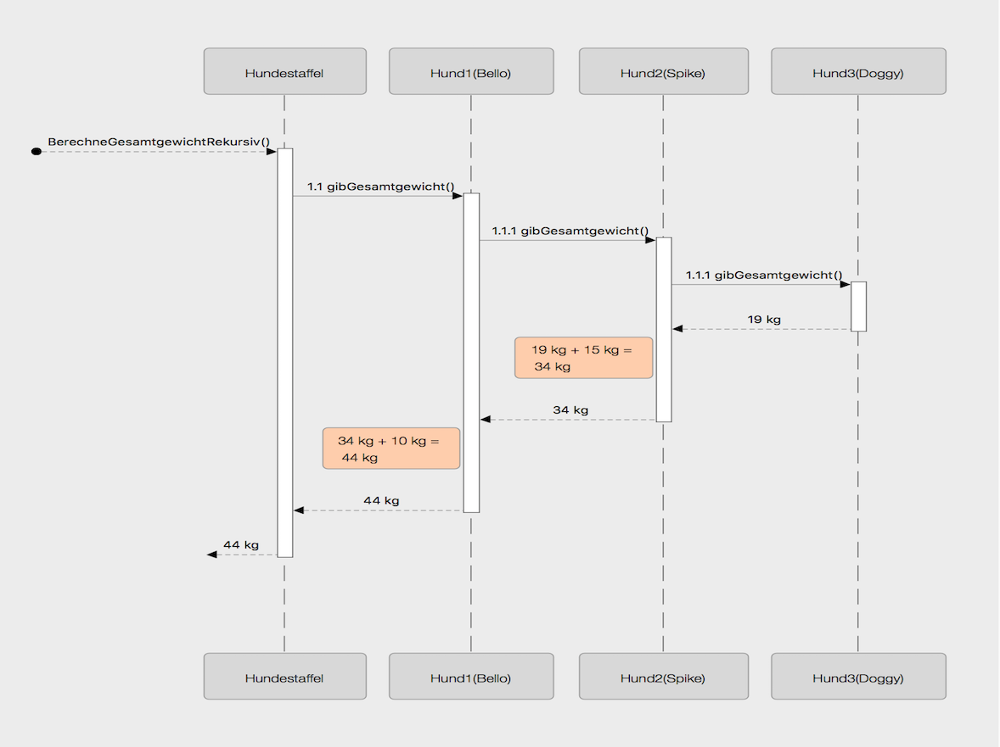

# Hunde bellen III

Um das Gewicht der gesamten Hundestaffel berechnen zu können, gibt es zwei mögliche Vorgehensweisen, die hier vorgestellt werden sollen. Im Folgenden sollen beide Arten vorgestellt und dann implementiert werden.

## Ablauf "iteratives Vorgehen"

Das folgende Sequenzdiagramm stellt den Ablauf zur Berechnungs des Gesamtgewichts der Hundestaffel auf _iterative Weise_ dar. Sequenzdiagramme haben dabei folgende Eigenschaften:

1. Methodenaufrufe werden mit durchgezogenen Pfeilen symbolisiert.
2. Rückgaben werden mit gestrichelten Pfeilen dargestellt.
3. Senkrechte _Lebenslinien eines Objekts_ sind entweder gestrichelt \(inaktiv\) oder ausgefüllt \(aktiv\).

Sequenzdiagramme visualisieren auf diese Weise den zeitlichen Ablauf der Objektkommunikation.

## Ablauf "rekursives Vorgehen"

Das folgende Sequenzdiagramm stellt den Ablauf zur Berechnungs des Gesamtgewichts der Hundestaffel auf _rekursive Weise_ dar.

## Aufgabe Hundegewicht

1. Formuliere das Vorgehen der beiden oben vorgestellten Algorithmen zur Berechnung des Gesamtgewichts der Hundestaffel in Worten.
2. Implementiere beide beschriebenen Algorithmen.

