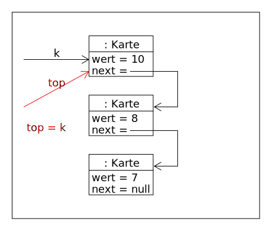
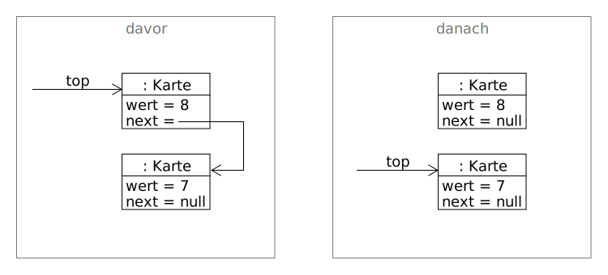

# Keep or Throw

_Keep or throw_ ist in der Grundversion ein Kartenspiel für eine Person, das sich leicht für mehrere Spieler variieren lässt. Die Spielregeln sind schnell erklärt:

Auf einem Stapel liegen unsortierte Karten. Der Spieler nimmt sich die oberste, betrachtet diese und muss sich nun entscheiden. Behält er die Karte, wird sie auf den Keep-Stapel gelegt, ansonsten auf den Restestapel \(Throw\). Ziel ist es möglichst viele Karten zu behalten. Allerdings darf der Keep-Stapel nur Karten in aufsteigender Reihenfolge enthalten. Äußerst ungeschickt wäre es also direkt am Anfang eine hohe Karte zu behalten. Alle folgenden, niedrigeren Karten müssten dann auf den Restestapel, weil die eine hohe Karte den Keep-Stapel quasi blockiert.

## Stapel von Spielkarten

Es gibt unterschiedliche Möglichkeiten, wie man einen Stapel von Karten im Computer realisieren kann. Eine mögliche Variante ist im folgenden Objektdiagramm dargestellt:

Das Objekt der Klasse Stapel ist hier für die Verwaltung der Objekte zuständig und besitzt eine Referenz auf das oberste Element mit dem Namen top. Jede Karte besitzt eine Referenz auf die Karte, die im Stapel unter ihr liegt. Die unterste Karte hat keine nächste Karte, speichert also folglich den Wert null.

Operationen, die man an einem Stapel üblicherweise ausführen möchte, sind:

* `isEmpty()` prüft, ob der Stapel leer ist.
* `top()` gibt das oberste Objekt des Stapels zurück, oder null, falls der Stapel leer ist.
* `push(Karte k)` legt ein Objekt - in unserem Fall eine Karte - auf den Stapel.
* `pop()` gibt das oberste Objekt des Stapel zurück und entfernt dieses. Falls der Stapel leer ist, wird `null` zurück gegeben.

Das Klassendiagramm hat damit folgende Form:

Beachte insbesondere die Beziehung zwischen `Karte` und `Karte`. Da eine Karte eine Referenz auf eine andere Karte speichert, erhält man im Klassendiagramm eine _**reflexive Beziehung**_, also eine Beziehung zwischen Objekten des gleichen Typs.

Für die Implementierung und das systematische Testen des Spiels ist es von Vorteil den Konstruktor der Klasse `Karte` zu überladen. Der parameterlose Konstruktor erzeugt eine Karte mit zufälligem Wert, während der Konstruktor mit Parameter den Wert der Karte übergeben bekommt.

Der Wert einer Karte soll zur Vereinfachung eine ganze Zahl sein. Die Methode `getWert()` der Klasse `Karte` könnte auch weggelassen werden, wenn man das Attribut `wert` nicht als `privat` definiert.

## Aufgaben

1. Erläutere die Funktionsweise der `push`-Methode im Prototypen. Gehe dazu auf folgende Grafiken ein:

 2. Überlege Dir ob und/oder inwiefern sich die Vorgehensweise bei einem leeren Stapel unterscheiden muss. 3. Beim Entfernen einer Karte muss die top-Referenz neu gesetzt und die Karte vom Stapel isoliert werden: 

Der _Garbage-Collector_ \(deutsch: Müllsammler\) von Java erkennt Objekte, auf die keine Referenz mehr existiert, und entfernt diese aus dem Speicher. Die Karte mit dem Wert 8 kann dann entfernt werden. \(Knobelaufgabe: Warum ist es notwendig, dazu auch das `next`-Attribut der zu entfernenden Karte auf `null` zu setzen? Beschreibe eine entsprechende Situation.\) 4. Zeichne in das Objektdiagramm ähnlich der obigen Darstellung die Schritte ein, die notwendig sind, um das oberste Element des Stapels zu löschen und anschließend zurückzugeben. Benutze dazu eine entsprechende Software. Tipp: Du benötigst eine lokale Variable. 5. Teste die `pop`-Methode und teste sie mit Hilfe des Objektinspektors. Überlege Dir inwiefern die Vorgehensweise sich bei einem leeren Stapel unterscheiden muss. 6. Teste das Spiel ausführlich und verändere es, mit eigenen Ideen :-\)

