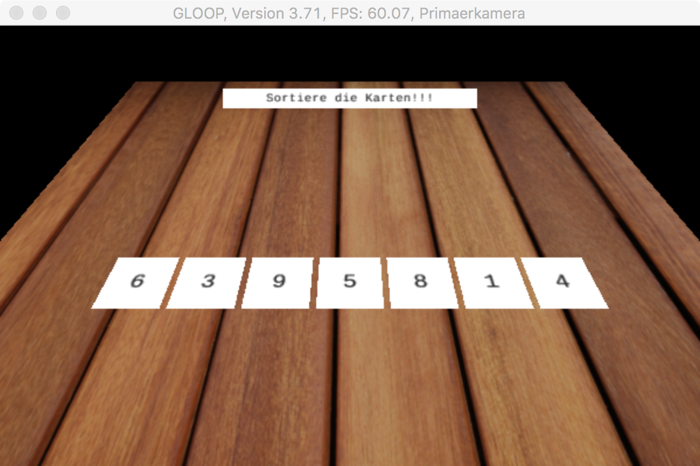

# Karten sortieren



**Aufgaben**  
1. Implementieren Sie mindestens zwei der folgenden Sortieralgorithmen:

* Sortieren durch Einfügen \(Insertionsort\)
* Sortieren durch Auswahl \(Selectionsort\)
* Sortieren durch Tauschen \(Bubblesort\)

Verwenden Sie dazu folgenden Prototypen:

**Klasse Kartenspiel**

```java
import GLOOP.*;
/**
 * Anwendungsklasse
 * 
 */
public class Kartenspiel
{

    private GLKamera dieKamera;
    private GLLicht dieLampe;
    private GLTastatur dieTastatur;
    private GLQuader derTisch;
    private Karte[] dieKarte;
    private GLTafel anzeigeTafel;

    public Kartenspiel()
    {
        dieKamera = new GLSchwenkkamera(600,400);
        dieKamera.setzePosition(0,250,250);
        dieKamera.setzeBlickpunkt(0,0,0);
        dieLampe = new GLLicht();
        dieTastatur = new GLTastatur();

        derTisch = new GLQuader(0,-5,0,600,10,600);
        derTisch.setzeTextur("Holzboden.jpg");

        //Anzeigetafel
        anzeigeTafel = new GLTafel(0,100,-50,  200,15 );
        anzeigeTafel.setzeText("Sortiere die Karten!!!",10); 
        anzeigeTafel.setzeAutodrehung(true);
        dieKarte = new Karte[7];


        dieKarte[0]= new Karte(0,6);
        dieKarte[1]= new Karte(1,3);
        dieKarte[2]= new Karte(2,9);
        dieKarte[3]= new Karte(3,5);
        dieKarte[4]= new Karte(4,8);
        dieKarte[5]= new Karte(5,1);
        dieKarte[6]= new Karte(6,4);

    }
    public void bubbleSort()
    {

    }

    public void selectionSort() 
    {

    }

    public void insertionSort()
    {

    }
}
```

**Klasse Karte**

```java
import GLOOP.*;
/**
 * Beschreiben Sie hier die Klasse Karte.
 * Klasse des Objekts der zu sortierenden Elemente
 */
public class Karte
{

    private GLTafel dieTafel;
    private int platz, nummer;

    public Karte(int pP, int pN)
    {
        this.setzeNummer(pN);
        this.setzePlatz(pP);
        dieTafel = new GLTafel(platz*55-165,1,55,50,50);
        dieTafel.drehe(270,0,0);
        dieTafel.setzeText(""+nummer,20);
    }

    public void verschiebe(int x, int y, int z)
    {
        dieTafel.verschiebe(x,y,z);
    }


    public float gibX()
    {
        return dieTafel.gibX();   
    }

    public float gibZ()
    {
        return dieTafel.gibZ();   
    }

    public void setzePlatz(int pPlatz)
    {
        this.platz = pPlatz;
    }

    public int gibPlatz()
    {
        return this.platz;

    }

    public void setzeNummer(int pNummer)
    {
        this.nummer = pNummer;
    }

    public int gibNummer()
    {
        return this.nummer;
    }

    public void markiere(int pF)
    {
        if(pF==1) dieTafel.setzeFarbe(1,0,0);
        if(pF==0) dieTafel.setzeFarbe(1,1,1);
    }

}
```

## Lizenz der sichtbaren Holztextur

[“2010\_2303 - Wood Textures\_5”](https://www.flickr.com/photos/benhosking/4455687333) by  [Ben Hosking](https://www.flickr.com/people/benhosking/) is licensed under [CC BY 2.0](https://creativecommons.org/licenses/by/2.0)

